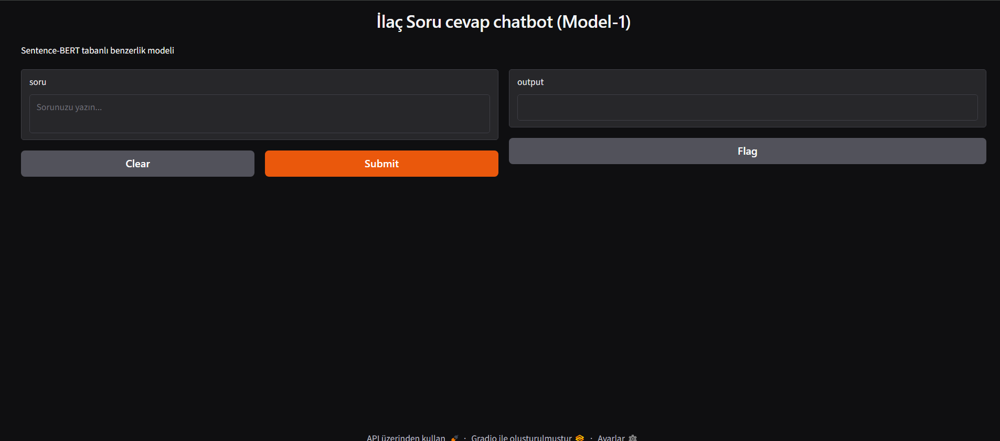

#  MedQA-Bot:SentenceBERT Tabanlı İlaç Soru-Cevap Chatbotu

Doğal Dil İşleme (NLP) ve Anlamsal Arama (Semantic Search) teknikleri kullanılarak geliştirilmiş  akıllı soru-cevap asistanı.

[](https://colab.research.google.com)
[](https://gradio.app/)
[](https://www.sbert.net/)

---

## Proje Özeti

Kullanıcıların ilaç kullanımı, yan etkiler ,etkileşimler hakkındaki doğal dilde sorduğu soruları anlamsal olarak analiz eder ve medikal veri tabanından en doğru yanıtı eşleştirerek kullanıcıya sunar. 

Basit anahtar kelime eşleştirmesi yerine **vektörel anlamsal benzerlik (Semantic Similarity)** kullandığı için eş anlamlı kelimeleri ve farklı cümle kalıplarını başarıyla kavrar.

---

##  Mimari ve Kullanılan Teknolojiler

* **Veri Seti:** Hugging Face `truehealth/medicationqa` (Kapsamlı medikal soru-cevap veri seti).
* **NLP & Embedding Modeli:** `sentence-transformers/all-MiniLM-L6-v2` (Hızlı, hafif ve güçlü anlamsal vektör üretici).
* **Benzerlik Metriği:** `scikit-learn` Cosine Similarity (Kosinüs Benzerliği).
* **Kullanıcı Arayüzü (UI):** `Gradio` (Modern, tarayıcı tabanlı interaktif web arayüzü).
* **Metrik & Değerlendirme:** Train-Test Split (%80 / %20) ve NLP değerlendirme metrikleri (BLEU / ROUGE).

---

## Nasıl Çalışır?

1. **Veri Ön İşleme:** Ham medikal veriler temizlenir, eksik değerler filtrelenir ve soru-cevap çiftleri yapılandırılır.
2. **Vektörel Temsil (Vector Embeddings):** Veri tabanındaki tüm sorular Sentence-BERT modeli ile yoğun vektör uzayına aktarılır.
3. **Anlamsal Eşleme:** Kullanıcıdan gelen soru anlık olarak vektöre dönüştürülür ve Cosine Similarity ile veri setindeki en yakın anlamlı soru tespit edilir.
4. **Çıktı & Sunum:** En yüksek skora sahip sorunun yanıtı Gradio arayüzü üzerinden kullanıcıya iletilir.

---

##kurulum ve Çalıştırma

Projeyi yerel ortamınızda veya Google Colab üzerinde çalıştırmak için:

```bash
# Gerekli kütüphaneleri yükleyin
pip install datasets pandas sentence-transformers scikit-learn gradio nltk rouge-score
